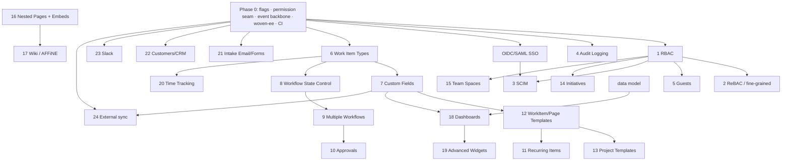

# Plane Fork — "Open EE" Program Plan

> **Goal:** Build the features Plane gates behind its paid **Commercial** tiers (Pro / Business /
> Enterprise) — plus Woven-specific integrations — directly into our **Community-Edition fork**
> (`aRustyDev/plane`), so `projects.woven` gets real Zitadel SSO, RBAC, audit, and the rest without
> a commercial license.
>
> **Status:** DRAFT. Codebase recon in flight (`research/`). Feature specs land after recon.
> **Prefix:** beads `plane-*`. **Base:** fork of `makeplane/plane` @ branch `preview`.

## 1. Why this program exists

We deployed Plane **CE** to woven-o11y (`projects.woven`, images `makeplane/plane-*:v1.3.1`). CE is
at feature-parity with Plane Cloud's **Free** tier only. The features we want — **OIDC/SAML SSO,
RBAC, audit logs, custom fields, workflows, dashboards, templates, time tracking, wiki, integrations**
— are all Commercial/paid and **absent from the CE source** (no `ee/` module exists in the tree).

Rather than pay per-seat for Plane Commercial (and run closed-source images), we build these into the
open fork. This document is the umbrella; each feature gets its own grounded spec under `features/`.

## 2. Guiding principles (fork & upstream discipline)

1. **Clean-room only.** We may modify AGPL CE code freely, but we **must not copy Plane's
   closed-source Commercial code**. Design from public docs + behavior, not their EE source.
2. **AGPL v3 compliance.** CE is AGPL-3.0; our fork is a derivative. The network-use clause means
   users of the hosted service can request corresponding source. Internal/WARP-only eases this, but
   we keep our modifications in-repo and offer-able. (Decision D-LICENSE — see §8.)
3. **Isolation for merge-ability.** Prefer **new Django apps** (`apps/api/plane/<feature>/`) and
   **new packages** over editing core files. When core edits are unavoidable, keep them small,
   flagged, and clearly marked (`# woven:`), so periodic upstream merges from `makeplane/plane`
   stay tractable.
4. **Feature-flagged.** Every feature ships behind an instance/workspace flag so we can land
   incrementally and dark-launch. (Foundation task in Phase 0.)
5. **Additive, reversible migrations.** New tables/columns only; no destructive edits to core
   tables where avoidable; every migration reversible.
6. **Test + docs per feature.** Acceptance tests (API + UI) and user/operator docs are part of
   "done", mirroring the `plane-so` deploy plan's rigor.
7. **Deploy path already exists.** These land in `products/plane/kube` (infra repo) as a custom
   image built from this fork — the PoC proxy/TLS/ESO plumbing is done.

## 2.5 What recon changed — we're *completing dormant stubs*, not greenfielding

The CE source is not a blank slate: Plane ships **dormant schema and explicit EE seams** that its
closed Commercial code fills in. We complete them with our **own clean-room** management layer
(never their EE code). This lowers risk and shapes every spec:

- **Work Item Types** — `IssueType`/`ProjectIssueType` + `Issue.type` FK + `is_issue_type_enabled`
  already exist; **no viewset/URL/creation path**. We add the management layer, not the schema.
- **Nested Pages** — `Page.parent` (self-FK) + recursive hierarchy ops **already exist**; the gap is UI
  + a workspace-page service in `apps/live` (the `workspace_page` documentType is already enumerated).
- **Intake email**, **integrations** (GitHub/Slack models), **DeployBoard `page` type**, **teamspaces**
  (enum/routing + store shims), **worklogs / templates / initiatives** — all present as **stubs/types-only**.
- **Frontend already has an EE seam**: React-Router route seam `app/routes/extended.ts`, editor
  `core/ce/ee` layout, `TPageExtended` / `extended.service.ts`. Our features slot into these seams.
- **No feature-gating exists** (`edition=PLANE_COMMUNITY` hardcoded; `license_key` removed in mig 0005)
  — nothing to bypass; we just build (behind our own flags).
- **Reusable spines**: outbound **webhooks** (SSRF-hardened) + the `issue_activity` pipeline + `/api/v1`
  PAT auth (`X-Api-Key`) + `external_id`/`external_source` idempotency fields — Audit, Slack, Intake, and
  external Sync ride these instead of inventing plumbing.

> ⚠ **Backend gotchas** (from recon): `Issue.save()` is heavy (advisory lock, `sequence_id`, `ChangeTrackerMixin`)
> and **bulk ops bypass it** — sync/import paths must replicate it; two-tier managers hide triage/archived/draft
> rows; soft-delete is universal — every new table needs `deleted_at` + a partial unique constraint.

## 3. Feature inventory (24 — deduped)

`Guests` and `Guest Access` merged. Grouped into clusters; each becomes a bead + a `features/*.md` spec.

| # | Feature | Cluster | Plane tier it replaces |
|---|---------|---------|------------------------|
| 1 | RBAC (custom roles) | Access Control | Business |
| 2 | ReBAC + fine-grained work-item access | Access Control | Enterprise |
| 3 | SCIM provisioning | Access Control | Enterprise |
| 4 | Audit Logging (API + UI) | Access Control | Enterprise |
| 5 | Guests & Guest Access | Access Control | Pro/Business |
| 6 | Work Item Types | Work-Item Modeling | Pro |
| 7 | Work Item Custom Properties/Fields | Work-Item Modeling | Pro |
| 8 | Workflow State-Transition Control | Work-Item Modeling | Business |
| 9 | Multiple Workflows | Work-Item Modeling | Enterprise |
| 10 | Workflow Approvals | Work-Item Modeling | Enterprise |
| 11 | Recurring Work Items | Work-Item Modeling | Business |
| 12 | Work Item / Page Templates | Templates & Reuse | Pro |
| 13 | Project Templates | Templates & Reuse | Business |
| 14 | Initiatives | Structure | Pro |
| 15 | Team Spaces | Structure | Pro |
| 16 | Nested Pages + Embeds | Knowledge | Business |
| 17 | Workspace Wiki (external → AFFiNE) | Knowledge | Pro + Woven |
| 18 | Dashboards | Dashboards | Pro |
| 19 | Advanced Dashboard Widgets | Dashboards | Business |
| 20 | Time Tracking (WakaTime/WakaAPI + pomodoro) | Productivity | Pro + Woven |
| 21 | Intake Email / Forms | Intake & Customers | Business |
| 22 | Customers (CRM integration or CRM API) | Intake & Customers | Business + Woven |
| 23 | Slack Integration (2-way) | Integrations | Pro |
| 24 | External sync (Beads, GitHub, GitLab, Gitea) | Integrations | Pro + Woven |

**Not in the list but implied earlier:** OIDC/SAML SSO. The Zitadel OIDC app is already applied and
dormant; adding a generic-OIDC auth provider to the fork is the natural companion to Access Control —
tracked as a Phase-1 item (`features/oidc-saml-sso.md`) so `projects.woven` finally gets Zitadel SSO.

## 4. Cross-cutting foundations (Phase 0 — build first)

These unblock many features; doing them once, well, avoids 24 bespoke hacks:

- **F0.1 Feature-flag + instance/workspace config plumbing** — a place to gate every feature.
- **F0.2 Permission-layer seam** — refactor the DRF permission enforcement so custom roles (RBAC)
  and per-object rules (ReBAC) can slot in without editing every viewset. *(Depends on recon:
  `auth-permissions.md`.)*
- **F0.3 Event/outbox backbone** — a reliable internal event stream (issue/page/member changed)
  that Audit, Slack, external sync, recurring items, and intake all consume. *(Depends on recon:
  `integrations-workflow.md` — reuse webhooks if they exist.)*
- **F0.4 `woven-ee` isolation convention** — the app/package layout + `# woven:` markers + CI that
  flags core-file drift against upstream, so merges stay sane.
- **F0.5 Fork CI + custom image build** — build `plane-*` images from this fork, wired to the infra
  repo's `products/plane/kube` deploy.

## 5. Dependency graph

## 6. Phased roadmap

| Phase | Theme | Features | Rationale |
|-------|-------|----------|-----------|
| **0** | Foundations | F0.1–F0.5 | Flags, permission seam, event backbone, isolation, CI — unblock the rest |
| **1** | Access & Identity | OIDC/SAML SSO · RBAC · ReBAC · Guests · SCIM · Audit | Highest value (real Zitadel SSO + security posture); RBAC underpins later work |
| **2** | Work-Item Modeling | Work Item Types · Custom Fields · Workflow State Control · Multiple Workflows · Approvals | The modeling substrate templates/dashboards/sync build on |
| **3** | Templates & Structure | WorkItem/Page Templates · Project Templates · Recurring Items · Initiatives · Team Spaces | Reuse + org structure, once modeling exists |
| **4** | Knowledge & Views | Nested Pages + Embeds · Wiki (AFFiNE) · Dashboards · Advanced Widgets | Collab + analytics surfaces |
| **5** | Productivity & External | Time Tracking (WakaTime/pomodoro) · Intake Email/Forms · Customers/CRM · Slack · External sync (Beads/GH/GL/Gitea) | Integrations that ride the event backbone |

**Ordering (per D-ORDER, resolved):** **OIDC/SAML SSO ships FIRST** — a near-standalone deliverable
(recon: clone the Gitea OAuth adapter, already `openid email profile`-scoped; wire it through the ~6
manual provider sites) — ahead of the rest of Access & Identity, so `projects.woven` gets Zitadel login
immediately and the dormant applied Zitadel app goes live.

Each phase is a checkpointed milestone (PR-gated), mirroring the `plane-so` progressive-rollout style.

## 7. Per-feature spec format (`features/<slug>.md`)

Each feature spec will carry: **Goal** · **Plane-tier parity target** · **Background** (grounded in
`research/`) · **Design/approach** (backend model + migrations, API, frontend, realtime if any) ·
**Feature flag** · **Phased tasks** (→ beads) · **Acceptance tests** (API + UI) · **Docs** · **Risks
& upstream-merge impact**.

## 8. Open decisions (need operator input)

- **D-LICENSE** — Confirm AGPL posture: keep modifications in-repo + source-offer-able; internal-only
  distribution. (Recommend: yes, document in `LICENSE`/README, no redistribution beyond Woven.)
- **D-BASE** — Track upstream `preview` (fast, unstable) or pin to a stable tag and merge selectively?
  (Recommend: pin to the `v1.3.1` tag we deployed, merge upstream deliberately.)
- **D-SCOPE/ORDER** — ✅ RESOLVED (2026-07-24): **OIDC/SAML SSO ships first**, then Phase 1→5 as ordered.
- **D-DEPTH** — ✅ RESOLVED (2026-07-24): **lean one-pager per feature now**, deepen per-phase at execution.
- **D-CRM** — "Customers": integrate with an existing CRM, or expose a CRM-style API from Plane?
  (Spec recommendation: **expose a native Plane CRM API** — `Customer`/`CustomerRequest` models behind
  `/api/` + `/api/v1` PAT — since Woven has no standard CRM to sync to; keep external `external_id`
  upserts open as an optional bolt-on. Operator to confirm.)
